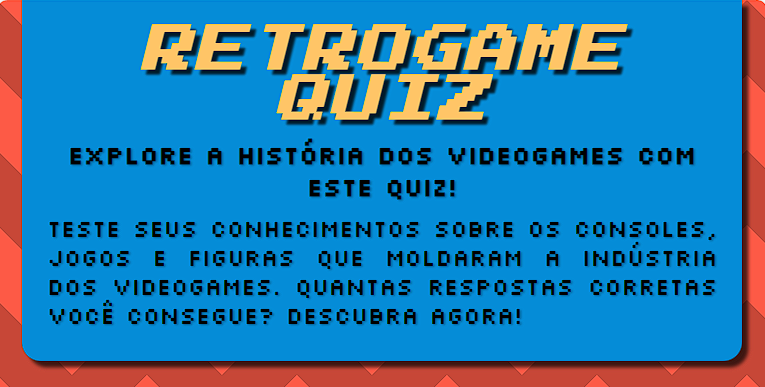

# RetroGame Quiz

O projeto RetroGame Quiz foi feito para implementar minhas habilidades em HTML5, CSS3 e JavaScript em um projeto prático.

### 🚀 Status

- Finalizado ✅

### 🔗 Link para acesso

- [RetroGame Quiz](https://carolinalimaal.github.io/retrogameQuiz/)

### 🛠 Tecnologias

As seguintes ferramentas foram usadas na construção do projeto:

- [HTML](https://developer.mozilla.org/pt-BR/docs/Web/HTML)
- [CSS](https://developer.mozilla.org/pt-BR/docs/Web/CSS)
- [JavaScript](https://developer.mozilla.org/pt-BR/docs/Web/JavaScript)
- [Git](https://git-scm.com/)

## ✨ Autor
- [Carolina de Lima Alves](https://carolinalimaal.github.io/my-portfolio/)
